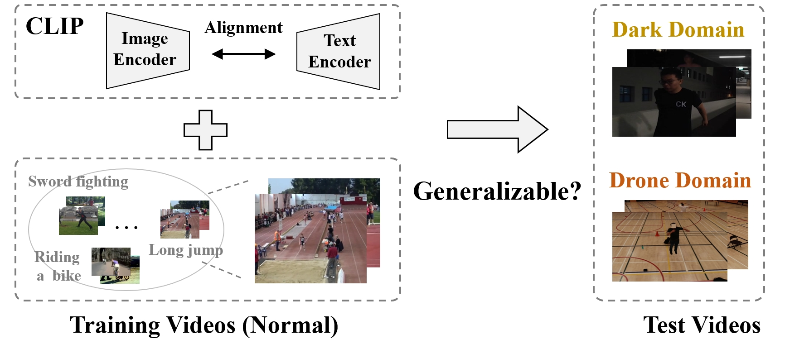
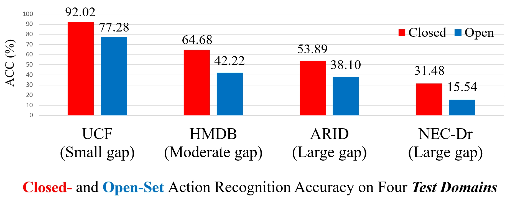

# Rethinking CLIP-based Video Learners in Cross-Domain Open-Vocabulary Action Recognition

## Overview


<!-- https://github.com/KunyuLin/XOV-Action/blob/main/xovaction_setting.png?raw=true -->

- This repository is for the paper titled "*Rethinking CLIP-based Video Learners in Cross-Domain Open-Vocabulary Action Recognition*". 
In this work, we delve into an intriguing question: **Can CLIP-based video learners effectively generalize to video domains that they have not encountered during training?** 



<!-- https://github.com/KunyuLin/XOV-Action/blob/main/xovaction_results.png?raw=true -->

- We establish a **CROSS**-domain **O**pen-**V**ocabulary **Action** recognition (**XOV-Action**) benchmark, and our evaluation reveals that existing CLIP-based video learners exhibit limited performance when recognizing actions in unseen test domains.
- To address the cross-domain open-vocabulary action recognition task, our work focuses on a critical challenge, namely scene bias, and we accordingly contribute a novel scene-aware video-text alignment method. 


## XOV-Action Benchmark
### New Features
- XOV-Action is the first benchmark, composed of two training datasets and four test datasets, for evaluating models in the cross-domain open-vocabulary action recognition task. 
- We identify closed-set and open-set categories for each test domain, thus providing a comprehensive way to evaluate models across various situations. *This is  different from prevailing existing open-vocabulary action recognition works that treat all the categories in another datasets as open-set.* 

### Benchmark Components
#### Training Datasets 
- **Kinetics400**: One of the most widely-used action recognition datasets, consisting of 400 action categories.
- **Kinetics150**: A subset of Kinetics400, composed of 150 action categories selected from the full Kinetics400.
#### Test Datasets
- **UCF101**: One of the most widely-used action recognition datasets, consisting of 101 action categories.
- **HMDB51**: A widely-used action recognition datasets consisting of 51 action categories.
- **ARID**: A dataset consisting of 11 categories of action videos, which are recorded under dark environments.
- **NEC-Drone**: A dataset consisting of 16 categories of action videos, which are recorded by drones in the same basketball court. 

### Evaluation Metrics
- The **closed-set accuracy** measures the recognition performance of closed-set categories, which primarily evaluates the model abilities of tackling domain gaps.
- The **open-set accuracy** measures the performance of open-set categories, which evaluates the generalization abilities across both video domains and action categories.
- The **overall accuracy** measures the recognition performance over all categories, which provides a holistic view of model effectiveness across various situations.

Please refer to our paper for more details. 

## Methodology
- The code for our proposed method is coming soon. 


## Acknowledgement 
- Our benchmark is established based on [Kinetics400](https://arxiv.org/abs/1705.06950), [UCF101](https://www.crcv.ucf.edu/data/UCF101.php), [HMDB51](https://serre-lab.clps.brown.edu/resource/hmdb-a-large-human-motion-database/), [ARID](https://xuyu0010.github.io/arid.html) and [NEC-Drone](https://www.nec-labs.com/research/media-analytics/projects/unsupervised-semi-supervised-domain-adaptation-for-action-recognition-from-drones/). Thanks for the authors' diligent efforts and significant contributions. 

- Our method is implemented based on the codebases [ViFi-CLIP](https://github.com/muzairkhattak/ViFi-CLIP) and [Open-VCLIP](https://github.com/wengzejia1/Open-VCLIP). Thanks for the authors' high-quality codebases. 

- If you find our paper/code/benchmark useful, please consider citing our paper:
```
@inproceedings{lin2024xovaction,
  author       = {Kun-Yu Lin, Henghui Ding, Jiaming Zhou, Yi-Xing Peng, Zhilin Zhao, Chen Change Loy, Wei-Shi Zheng},
  title        = {Rethinking CLIP-based Video Learners in Cross-Domain Open-Vocabulary Action Recognition},
  year         = {2024},
}
```

